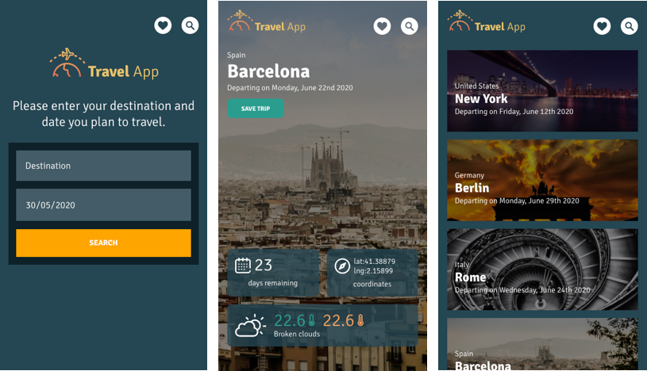

# Travel App Project

## Overview
This project is an asynchronous web app that uses Web APIs and user data to dynamically update the UI.
It is the final project for front-end developer nanodegree at udacity.

## Instructions

### Install

1. Install Node.js 

download [here](https://nodejs.org/)

2. The project  requires Express and cors:

## APIs used

* [Geonames](https://www.geonames.org/login) -> Destination lat, lng and country

* [Weather bit](https://www.weatherbit.io/api) -> Weather forecast

* [Pixabay](https://pixabay.com/) -> Destination image

## Get Started

1. Download or clone the repository
2. Install all dependencies
    * type `npm install` on your terminal
3. Add dist folder
    * `npm run build-prod` on the terminal
4. For use all APIs (Geonames, Weather bit and Pixabay) register to get an API key
    * Create a `.env` with your apis `GEONAMES_USERNAME=***`, `PIXABAY_API_KEY=***` and `WEATHERBIT_API_KEY=***`

## Run Project

### 1. Production Mode
- `npm run build-prod` to generate the distribution folder.
- Production mode can be accessed at `localhost:8081`

### 2. Development Mode
- `npm run build-dev` to start the webpack dev server.
- Development mode can be accessed at `localhost:8080`

**Note: To successfuly run and test development mode, express server should be running.**

### 3. Testing
- `npm run test` to run Jest.

## How it works?
Add a destination and a date on the search form to get information about your trip.
Save or delete your favorite trips on your trip view.
Access to your saved views from  "my trips" menu.